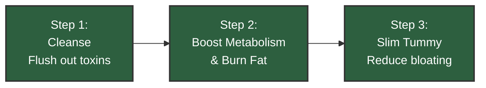
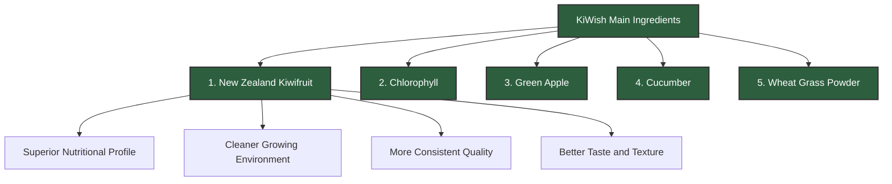
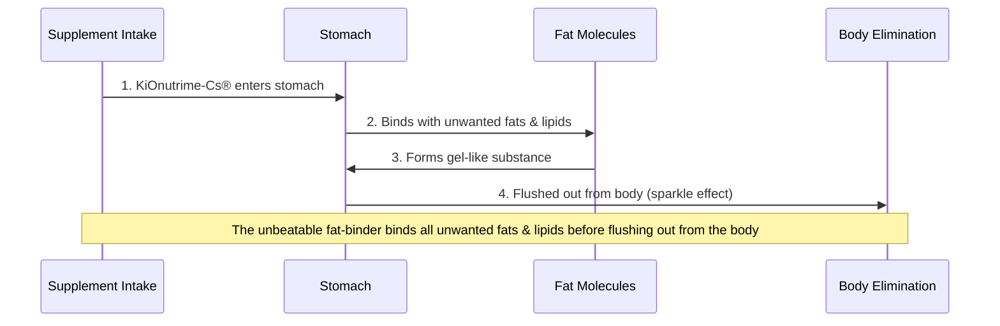

# KiWish

## Product Summary

### DETOX DRINK / 健康排毒饮料

**Stubborn Fat Reduction & Clean Burn Formula**

KiWish Detox is a refreshing, plant-powered blend designed to gently cleanse your body from the inside out. Infused with antioxidant-rich fruits, natural fibers, and botanical extracts, this daily wellness tonic helps support digestion, reduce bloating, and revitalize your glow—all without harsh ingredients or artificial additives.

---

## Key Benefits at a Glance

| Category | Benefit |
|----------|---------|
| **Detoxification** | Gentle gut and liver cleansing, toxin removal |
| **Metabolism** | Boost metabolism and burn fat even at rest |
| **Digestion** | Improved digestion, reduced bloating, lighter gut feeling |
| **Weight Management** | Prevents fat storage, converts existing fat to energy |
| **Cholesterol** | Lowers cholesterol and maintains healthy blood lipid levels |
| **Blood Sugar** | Regulates blood glucose levels |
| **Gut Health** | Increases friendly bacteria, supports digestive disorders |
| **Nutrient Absorption** | Enhanced bioavailability and nutrient uptake |

---

## How KiWish Works

### Three-Step Process

#### 1. Cleanse (Flush out toxins)

When body system is overloaded, fat burning will slows down. KiWish gently detoxes your gut and liver, clearing out toxins & waste to reset your body.

#### 2. Boost Metabolism & Burn Fat (Even when you are rest)

Prevent fat storage & converts existing fat into energy, allowing body to melt stubborn fat naturally without needing intense workouts.

#### 3. Slim Tummy (Reduce bloating)

Improve digestion & bloating. Your gut feels lighter, waistline starts to show the difference.

---

## Key Ingredients

### 5 Main Greens Ingredients

#### 1. New Zealand Kiwifruit
- ✓ Superior Nutritional Profile
- ✓ Cleaner Growing Environment
- ✓ More Consistent Quality
- ✓ Better Taste and Texture

#### 2. Chlorophyll
Natural green pigment from plants

#### 3. Green Apple
Rich in antioxidants and fiber

#### 4. Cucumber
Hydrating and low-calorie vegetable

#### 5. Wheat Grass Powder
Nutrient-dense superfood

---

## Patented Ingredients

### KiWish Contains Three Patented Ingredients

| Ingredient | Origin | Key Benefits |
|------------|--------|--------------|
| **KiOnutrime-Cs®** Multi Enzyme Complex | 🇧🇪 Belgium | • Breaking down food efficiently • Better digestion helps body clear toxins more effectively • Bind at least 800 times its own weight in fat • EFSA approved health claims |
| **Sunfiber®** Guar Bean Fiber | 🇮🇳 India | • Lower cholesterol and glucose level • Increase the friendly bacteria in gut • Relieves constipation |
| **DigeZyme®** Plant Chitosan | 🇺🇸 USA | • Helps lower fat storage in the body • Prevent weight and fat gain • Enhanced nutrient absorption |

---

## Science Behind the Ingredients

### KiOnutrime-Cs® (Belgium) - The Fat-Binder

Patented weight and cholesterol management ingredient with positive health claim issued by EFSA related to chitosan and maintenance of normal blood LDL-cholesterol.

#### Mechanism of Action

#### Clinical Evidence

**Human Clinical Trial Results:**

| Test Type | KiOnutrime-Cs® Result | Chemelle Plant-Fibre Result |
|-----------|----------------------|----------------------------|
| Animal Chitosan Test | ✅ PASS (4/5 tubes) | ✅ PASS (1/5 tubes) |
| Chemelle Plant-Fibre Test | ✅ PASS (4/5 tubes) | ❌ FAIL (4/5 tubes) |

**Proven Results:**
- Binds at least 800 times its own weight in fat
- 33% more efficient than other fat-binders

---

### Sunfiber® (India) - Guar Bean Fiber

High soluble dietary fiber produced by enzymatic fermentation from the Indian guar bean.

**Properties:**
- 100% water-soluble bean fiber
- Partially hydrolyzed for easy absorption
- Maintains intestinal health

#### Proven Clinical Studies

##### Regulates Blood Sugar
Study shows significant reduction in plasma glucose levels over time (0-180 minutes) when compared to control diet.

##### Lowers Blood Lipids
Clinical results demonstrate:
- Reduction in Serum Cholesterol (from 194.3±5.9 to 168.1±3.1*)
- Reduction in Serum Triglyceride (from 88.8±3.7 to 80.5±7.8*)

*p < 0.05 (statistically significant)

##### Relieves Constipation
Defecation frequency improved from 0.46 to 0.66 times/day after 2 weeks of use in female participants.

---

### DigeZyme® (USA) - Multi-Enzyme Complex

#### Special Characteristics

| Feature | Description |
|---------|-------------|
| Source | Non-Animal Source 🐰 |
| Bioavailability | Enhanced Bioavailability (100%) |
| pH Stability | Stable Across pH Ranges |
| Allergen Status | Non-Irritation & Hypoallergenic 🌿 |

#### Health Benefits

```mermaid
graph TB
    A[DigeZyme Multi-Enzyme Complex] --> B[Improves Digestive Health]
    A --> C[Enhances Nutrient Absorption]
    A --> D[Supports Gut Health]
    A --> E[Benefits Digestive Disorders]
    
    B --> B1[Breaking down food efficiently]
    B --> B2[Reduces bloating, gas, and indigestion]
    B --> B3[Easier body processing]
    
    C --> C1[Complete breakdown of macronutrients]
    C --> C2[Better absorption of essential nutrients]
    C --> C3[Improved health and energy levels]
    
    D --> D1[Reduces workload on gut]
    D --> D2[Prevents undigested food issues]
    D --> D3[Maintains gut bacteria balance]
    
    E --> E1[Helpful for IBS]
    E --> E2[Supports chronic indigestion]
    E --> E3[Addresses enzyme deficiencies]
    
    style A fill:#2d5f3f,stroke:#333,stroke-width:2px,color:#fff
    style B fill:#2d5f3f,stroke:#333,stroke-width:2px,color:#fff
    style C fill:#2d5f3f,stroke:#333,stroke-width:2px,color:#fff
    style D fill:#2d5f3f,stroke:#333,stroke-width:2px,color:#fff
    style E fill:#2d5f3f,stroke:#333,stroke-width:2px,color:#fff
```

**1. Improves Digestive Health** - Efficiently breaks down food, reducing symptoms like bloating, gas, and indigestion.

**2. Enhances Nutrient Absorption** - Complete breakdown of macronutrients allows better absorption of essential nutrients, improving health and energy levels.

**3. Supports Gut Health** - Reduces workload on the gut and prevents undigested food from disrupting gut bacteria balance.

**4. Benefits Digestive Disorders** - Helpful for people with IBS, chronic indigestion, or enzyme deficiencies.

---

## Direction for Use

### 4 Steps for Taking KiWish

| Step | Instruction |
|------|-------------|
| 1 | Take 1 sachet daily |
| 2 | Mix with 150 ml of water |
| 3 | Can be taken anytime (preferably after meals / before sleep) |
| 4 | Powder dissolves easily with a quick stir |

### Tips for Best Results

💡 **TIPS DELICIOUS!** Can mix with cold water / ice for a refreshing taste!

---

## Why Choose KiWish?

### Quality Assurance

- ✓ Patented ingredients from Belgium, USA, and India
- ✓ EFSA health claims approved
- ✓ Human clinical trial tested
- ✓ Non-animal source
- ✓ Hypoallergenic and non-irritating
- ✓ Premium New Zealand kiwifruit
- ✓ No harsh ingredients or artificial additives
- ✓ Plant-powered wellness formula

---

## Frequently Asked Questions

### How long will it take to see results?

Individual results may vary. Most users report feeling lighter and less bloated within the first week. For optimal weight management and metabolic benefits, consistent use for 2-4 weeks is recommended.

### Can I take KiWish if I'm on medication?

While KiWish contains natural ingredients, we recommend consulting with your healthcare provider before starting any new supplement, especially if you're taking medications or have existing health conditions.

### Is KiWish suitable for vegetarians/vegans?

Yes! KiWish is plant-powered and contains non-animal source ingredients, making it suitable for vegetarian and vegan lifestyles.

### Are there any side effects?

KiWish is formulated with natural, hypoallergenic ingredients. However, as with any dietary supplement, some individuals may experience mild digestive changes initially as the body adjusts. This is normal and typically subsides within a few days.

---

*KiWish is a dietary supplement containing patented ingredients designed to support weight management, digestive health, and overall wellness through natural, plant-based nutrition.*
