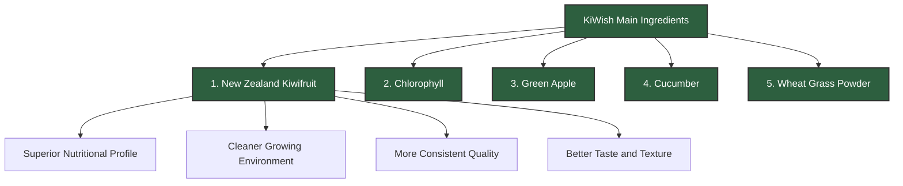
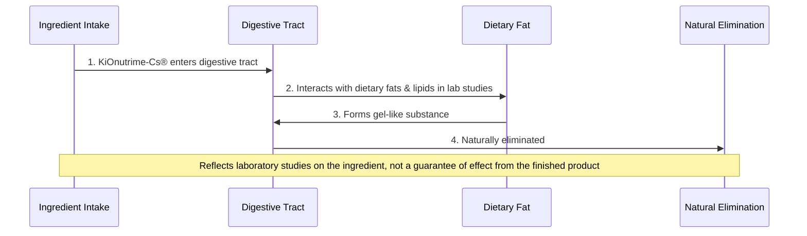

# KiWish

## Product Summary

### DETOX DRINK / 健康排毒饮料

**Plant-Powered Daily Wellness Formula**

KiWish Detox is a refreshing, plant-powered blend designed to gently support your body's everyday wellness as part of a balanced diet. Infused with antioxidant-rich fruits, natural fibers, and botanical extracts, this daily wellness tonic helps support digestion, ease everyday bloating, and revitalize your glow—all without harsh ingredients or artificial additives.

> This product is not intended to diagnose, treat, cure, or prevent any disease. Always consult a healthcare provider before starting any new supplement, particularly if pregnant, nursing, or managing a medical condition.

---

## Key Benefits at a Glance

| Category | Benefit |
|----------|---------|
| **Wellness Support** | Gentle daily nourishment from antioxidant-rich botanicals |
| **Metabolism** | Made with ingredients traditionally used to support a balanced metabolism |
| **Digestion** | Improved digestion, eased everyday bloating, lighter gut feeling |
| **Healthy Living** | Supports a balanced lifestyle as part of a varied, healthy diet |
| **Wellbeing** | Contains Sunfiber®, an ingredient with an EFSA-recognised role in supporting normal cholesterol and glucose levels* |
| **Gut Health** | Supports a healthy balance of gut bacteria |
| **Nutrient Absorption** | Enhanced bioavailability and nutrient uptake |

*This reflects an EFSA-approved claim for the specific ingredient Sunfiber®, not a guarantee of effect from the finished KiWish product.

---

## How KiWish Works

### Three-Step Process

```mermaid
flowchart LR
    A[Step 1:<br/>Nourish<br/>Daily wellness support] --> B[Step 2:<br/>Support<br/>Metabolism]
    B --> C[Step 3:<br/>Ease Bloating<br/>Digestive comfort]
    
    style A fill:#2d5f3f,stroke:#333,stroke-width:2px,color:#fff
    style B fill:#2d5f3f,stroke:#333,stroke-width:2px,color:#fff
    style C fill:#2d5f3f,stroke:#333,stroke-width:2px,color:#fff
```

#### 1. Nourish (Daily wellness support)

KiWish brings together antioxidant-rich fruits and botanical fibers in one daily blend, gently supporting your body's everyday wellness routine.

#### 2. Support Metabolism (As part of a balanced lifestyle)

Made with ingredients traditionally associated with a balanced metabolism, intended to be used alongside a healthy diet and regular activity.

#### 3. Ease Bloating (Digestive comfort)

Improve digestion & ease everyday bloating. Your gut feels lighter, helping you feel more comfortable day to day.

---

## Key Ingredients

### 5 Main Greens Ingredients

```mermaid
graph TD
    A[KiWish Main Ingredients] --> B[1. New Zealand Kiwifruit]
    A --> C[2. Chlorophyll]
    A --> D[3. Green Apple]
    A --> E[4. Cucumber]
    A --> F[5. Wheat Grass Powder]
    
    B --> B1[Superior Nutritional Profile]
    B --> B2[Cleaner Growing Environment]
    B --> B3[More Consistent Quality]
    B --> B4[Better Taste and Texture]
    
    style A fill:#2d5f3f,stroke:#333,stroke-width:2px,color:#fff
    style B fill:#2d5f3f,stroke:#333,stroke-width:2px,color:#fff
    style C fill:#2d5f3f,stroke:#333,stroke-width:2px,color:#fff
    style D fill:#2d5f3f,stroke:#333,stroke-width:2px,color:#fff
    style E fill:#2d5f3f,stroke:#333,stroke-width:2px,color:#fff
    style F fill:#2d5f3f,stroke:#333,stroke-width:2px,color:#fff
```

#### 1. New Zealand Kiwifruit
- ✓ Superior Nutritional Profile
- ✓ Cleaner Growing Environment
- ✓ More Consistent Quality
- ✓ Better Taste and Texture

#### 2. Chlorophyll
Natural green pigment from plants

#### 3. Green Apple
Rich in antioxidants and fiber

#### 4. Cucumber
Hydrating and low-calorie vegetable

#### 5. Wheat Grass Powder
Nutrient-dense superfood

---

## Patented Ingredients

### KiWish Contains Three Patented Ingredients

| Ingredient | Origin | Key Benefits (ingredient-level) |
|------------|--------|--------------|
| **KiOnutrime-Cs®** Multi Enzyme Complex | 🇧🇪 Belgium | • Supports efficient food breakdown • Supports normal digestion • Demonstrated fat-binding capacity in lab studies • EFSA-approved health claim for this specific ingredient |
| **Sunfiber®** Guar Bean Fiber | 🇮🇳 India | • EFSA-recognised role in supporting normal cholesterol and glucose levels • Supports a healthy balance of gut bacteria • Traditionally used to ease constipation |
| **DigeZyme®** Plant Chitosan | 🇺🇸 USA | • Studied for its role in supporting healthy fat metabolism • Enhanced nutrient absorption |

---

## Science Behind the Ingredients

### KiOnutrime-Cs® (Belgium)

A patented ingredient studied for its role in weight and cholesterol management, with a positive health claim issued by EFSA specifically for chitosan and the maintenance of normal blood LDL-cholesterol levels. The following reflects laboratory and ingredient-level research, not claims about the finished KiWish product.

#### How This Ingredient Has Been Studied

```mermaid
sequenceDiagram
    participant S as Ingredient Intake
    participant St as Digestive Tract
    participant F as Dietary Fat
    participant B as Natural Elimination
    
    S->>St: 1. KiOnutrime-Cs® enters digestive tract
    St->>F: 2. Interacts with dietary fats & lipids in lab studies
    F->>St: 3. Forms gel-like substance
    St->>B: 4. Naturally eliminated
    
    Note over S,B: Reflects laboratory studies on the ingredient, not a guarantee of effect from the finished product
```

#### Laboratory Research

**Ingredient-Level Lab Test Results:**

| Test Type | KiOnutrime-Cs® Result | Chemelle Plant-Fibre Result |
|-----------|----------------------|----------------------------|
| Animal Chitosan Test | PASS (4/5 tubes) | PASS (1/5 tubes) |
| Chemelle Plant-Fibre Test | PASS (4/5 tubes) | Did not pass (4/5 tubes) |

**Lab Findings:**
- Demonstrated fat-binding capacity of at least 800 times its own weight in lab studies
- Studied to be 33% more efficient than other comparable ingredients in lab conditions

---

### Sunfiber® (India) - Guar Bean Fiber

High soluble dietary fiber produced by enzymatic fermentation from the Indian guar bean. The research below reflects ingredient-level studies, not claims about the finished KiWish product.

**Properties:**
- 100% water-soluble bean fiber
- Partially hydrolyzed for easy absorption
- Supports normal intestinal function

#### Ingredient Research Summary

##### Supports Normal Glucose Levels
Ingredient-level research observed changes in plasma glucose measurements over time (0-180 minutes) when compared to a control diet. This reflects an EFSA-recognised role for Sunfiber® specifically, and is not a treatment claim for diabetes or any other condition.

##### Supports Normal Cholesterol Levels
Ingredient-level research observed:
- Changes in Serum Cholesterol measurements (from 194.3±5.9 to 168.1±3.1*)
- Changes in Serum Triglyceride measurements (from 88.8±3.7 to 80.5±7.8*)

*p < 0.05 (statistically significant in the ingredient study; results refer to Sunfiber® specifically, not the finished KiWish product)

##### Supports Regularity
Ingredient-level research observed defecation frequency improve from 0.46 to 0.66 times/day after 2 weeks of use among female study participants.

---

### DigeZyme® (USA) - Multi-Enzyme Complex

#### Special Characteristics

| Feature | Description |
|---------|-------------|
| Source | Non-Animal Source 🐰 |
| Bioavailability | Enhanced Bioavailability (100%) |
| pH Stability | Stable Across pH Ranges |
| Allergen Status | Non-Irritation & Hypoallergenic 🌿 |

#### Health Benefits

```mermaid
graph TB
    A[DigeZyme Multi-Enzyme Complex] --> B[Supports Digestive Comfort]
    A --> C[Enhances Nutrient Absorption]
    A --> D[Supports Gut Health]
    A --> E[Everyday Digestive Wellness]
    
    B --> B1[Breaking down food efficiently]
    B --> B2[Eases bloating and everyday discomfort]
    B --> B3[Easier body processing]
    
    C --> C1[Complete breakdown of macronutrients]
    C --> C2[Better absorption of essential nutrients]
    C --> C3[Supports overall energy levels]
    
    D --> D1[Reduces workload on gut]
    D --> D2[Supports complete digestion]
    D --> D3[Maintains gut bacteria balance]
    
    E --> E1[Suited to sensitive digestion]
    E --> E2[Supports occasional digestive discomfort]
    E --> E3[Complements naturally low enzyme levels]
    
    style A fill:#2d5f3f,stroke:#333,stroke-width:2px,color:#fff
    style B fill:#2d5f3f,stroke:#333,stroke-width:2px,color:#fff
    style C fill:#2d5f3f,stroke:#333,stroke-width:2px,color:#fff
    style D fill:#2d5f3f,stroke:#333,stroke-width:2px,color:#fff
    style E fill:#2d5f3f,stroke:#333,stroke-width:2px,color:#fff
```

**1. Supports Digestive Comfort** - Efficiently breaks down food, helping ease everyday bloating, gas, and indigestion.

**2. Enhances Nutrient Absorption** - Complete breakdown of macronutrients allows better absorption of essential nutrients, supporting overall energy levels.

**3. Supports Gut Health** - Reduces workload on the gut and supports a healthy balance of gut bacteria.

**4. Everyday Digestive Wellness** - Suited to people with sensitive digestion or occasional digestive discomfort. Not intended to diagnose, treat, or manage any medical condition.

---

## Direction for Use

### 4 Steps for Taking KiWish

| Step | Instruction |
|------|-------------|
| 1 | Take 1 sachet daily |
| 2 | Mix with 150 ml of water |
| 3 | Can be taken anytime (preferably after meals / before sleep) |
| 4 | Powder dissolves easily with a quick stir |

### Tips for Best Results

💡 **TIPS DELICIOUS!** Can mix with cold water / ice for a refreshing taste!

---

## Why Choose KiWish?

### Quality Assurance

- ✓ Patented ingredients from Belgium, USA, and India
- ✓ EFSA-approved health claim for a specific patented ingredient (Sunfiber®)
- ✓ Human clinical trial tested
- ✓ Non-animal source
- ✓ Hypoallergenic and non-irritating
- ✓ Premium New Zealand kiwifruit
- ✓ No harsh ingredients or artificial additives
- ✓ Plant-powered wellness formula

---

## Frequently Asked Questions

### How long will it take to see results?

Individual experiences may vary, and KiWish is not intended to produce guaranteed results. Some users report feeling lighter and less bloated within the first week of consistent use as part of a balanced diet.

### Can I take KiWish if I'm on medication?

While KiWish contains natural ingredients, we recommend consulting with your healthcare provider before starting any new supplement, especially if you're taking medications or have existing health conditions.

### Is KiWish suitable for vegetarians/vegans?

Yes! KiWish is plant-powered and contains non-animal source ingredients, making it suitable for vegetarian and vegan lifestyles.

### Are there any side effects?

KiWish is formulated with natural, hypoallergenic ingredients. However, as with any dietary supplement, some individuals may experience mild digestive changes initially as the body adjusts. This is normal and typically subsides within a few days.

---

*KiWish is a dietary supplement containing patented ingredients and is intended to support digestive health and overall wellness as part of a varied, balanced diet and healthy lifestyle. It is not intended to diagnose, treat, cure, or prevent any disease.*
