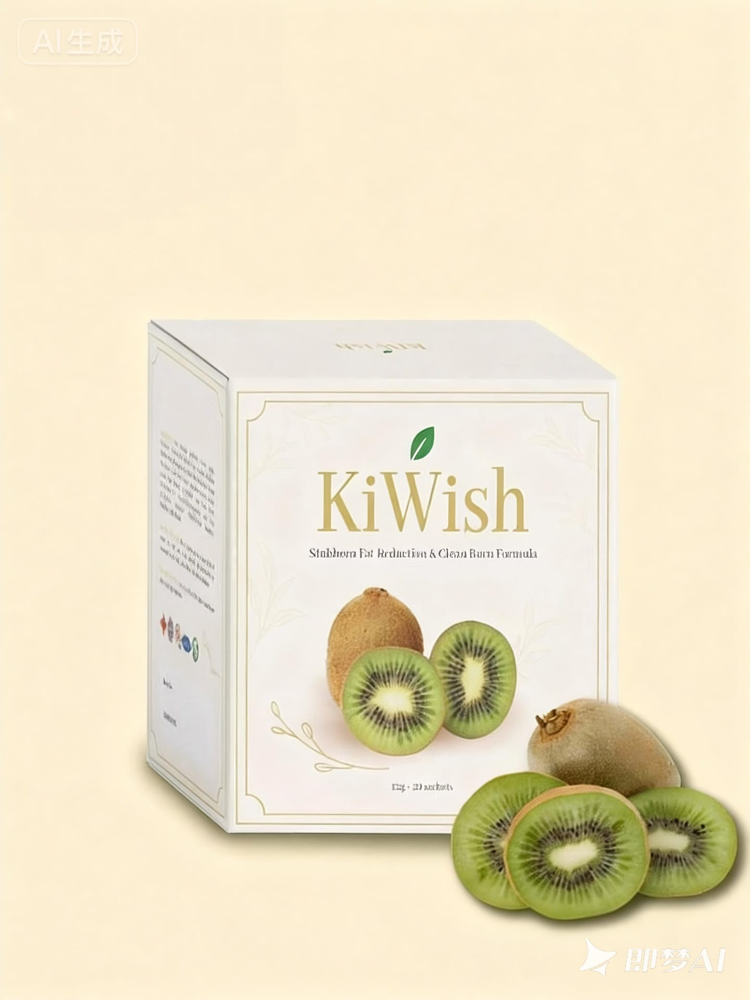

# KiWish - Plant-Powered Daily Wellness Formula



**KiWish Detox** is a refreshing, plant-powered blend designed to gently support your body from the inside out. Infused with antioxidant-rich fruits, natural fibers, and botanical extracts, this daily wellness tonic helps support digestion, ease everyday bloating, and revitalize your glow—all without harsh ingredients or artificial additives.

## 🌿 Key Benefits

- **Wellness Support**: Gentle daily nourishment with antioxidant-rich botanicals
- **Metabolism**: Made with ingredients traditionally used to support a balanced metabolism
- **Digestion**: Improved digestion, eased everyday bloating, lighter gut feeling
- **Healthy Living**: Supports a balanced lifestyle as part of a varied, healthy diet
- **Wellbeing**: Contains Sunfiber®, with ingredients that support normal cholesterol and glucose levels already within a healthy range*
- **Gut Health**: Supports a healthy balance of gut bacteria
- **Nutrient Absorption**: Enhanced bioavailability and nutrient uptake

*Reflects ingredient-level claims approved by EFSA for the specific patented ingredient, not a guarantee of effect from the finished product.

## 🍃 How KiWish Works - Three-Step Process

1. **Nourish** - KiWish brings together antioxidant-rich fruits and botanical fibers in one daily blend, gently supporting your body's everyday wellness routine.

2. **Support Metabolism** - Made with ingredients traditionally associated with a balanced metabolism, as part of a healthy diet and active lifestyle.

3. **Ease Bloating** - Improve digestion & ease everyday bloating. Your gut feels lighter, helping you feel more comfortable day to day.

## 🥝 Key Ingredients

### 5 Main Green Ingredients

1. **New Zealand Kiwifruit** - Superior nutritional profile with cleaner growing environment, consistent quality, and better taste and texture
2. **Chlorophyll** - Natural green pigment from plants
3. **Green Apple** - Rich in antioxidants and fiber
4. **Cucumber** - Hydrating and low-calorie vegetable
5. **Wheat Grass Powder** - Nutrient-dense superfood

### Patented Ingredients

| Ingredient | Origin | Key Benefits (ingredient-level) |
|------------|--------|--------------|
| **KiOnutrime-Cs®** Multi Enzyme Complex | Belgium | • Supports efficient food breakdown<br>• Supports normal digestion<br>• Demonstrated fat-binding capacity in lab studies<br>• EFSA-approved health claim for this specific ingredient |
| **Sunfiber®** Guar Bean Fiber | India | • Ingredient with EFSA-recognised role in supporting normal cholesterol and glucose levels<br>• Supports a healthy balance of gut bacteria<br>• Traditionally used to ease constipation |
| **DigeZyme®** Plant Chitosan | USA | • Studied for its role in supporting healthy fat metabolism<br>• Enhanced nutrient absorption |

## 🧬 Science Behind the Ingredients

### KiOnutrime-Cs® (Belgium)

A patented ingredient studied for its role in weight and cholesterol management, with a positive health claim issued by EFSA specifically for chitosan and the maintenance of normal blood LDL-cholesterol levels.

- Demonstrated fat-binding capacity of at least 800 times its own weight in lab studies
- Studied to be 33% more efficient than other comparable ingredients in lab conditions

### Sunfiber® (India) - Guar Bean Fiber

High soluble dietary fiber produced by enzymatic fermentation from the Indian guar bean.

- 100% water-soluble bean fiber
- Partially hydrolyzed for easy absorption
- Maintains intestinal health

### DigeZyme® (USA) - Multi-Enzyme Complex

- Non-Animal Source
- Enhanced Bioavailability (100%)
- Stable Across pH Ranges
- Non-Irritation & Hypoallergenic

## 📋 Usage Instructions

### 4 Steps for Taking KiWish

1. Take 1 sachet daily
2. Mix with 150 ml of water
3. Can be taken anytime (preferably after meals or before sleep)
4. Powder dissolves easily with a quick stir

> 💡 **TIPS DELICIOUS!** Can mix with cold water or ice for a refreshing taste!

## 🛠️ Installation & Setup

The KiWish website is built with HTML, CSS, and JavaScript:

1. Clone the repository:
   ```bash
   git clone https://github.com/weisiong/KiWish.git
   ```

2. Navigate to the project directory:
   ```bash
   cd KiWish
   ```

3. Open `Source/Index.html` in your preferred browser to view the product page.

## 🧾 Features

- **Responsive Design**: Works on all device sizes
- **Modern UI/UX**: Clean, attractive interface with KiWish branding
- **Product Information**: Detailed information about ingredients and benefits
- **Interactive Elements**: FAQ section with expandable questions
- **Call-to-Action**: Clear ordering options throughout the page
- **Visual Appeal**: Engaging animations and design elements

## 📞 Frequently Asked Questions

### How long will it take to see results?

Individual experiences may vary, and KiWish is not intended to produce guaranteed results. Some users report feeling lighter and less bloated within the first week of consistent use as part of a balanced diet.

### Can I take KiWish if I'm on medication?

While KiWish contains natural ingredients, we recommend consulting with your healthcare provider before starting any new supplement, especially if you're taking medications or have existing health conditions.

### Is KiWish suitable for vegetarians/vegans?

Yes! KiWish is plant-powered and contains non-animal source ingredients, making it suitable for vegetarian and vegan lifestyles.

### Are there any side effects?

KiWish is formulated with natural, hypoallergenic ingredients. However, as with any dietary supplement, some individuals may experience mild digestive changes initially as the body adjusts. This is normal and typically subsides within a few days.

## 🏆 Quality Assurance

- ✓ Patented ingredients from Belgium, USA, and India
- ✓ EFSA-approved health claim for a specific patented ingredient (Sunfiber®)
- ✓ Human clinical trial tested
- ✓ Non-animal source
- ✓ Hypoallergenic and non-irritating
- ✓ Premium New Zealand kiwifruit
- ✓ No harsh ingredients or artificial additives
- ✓ Plant-powered wellness formula

## 📜 License

This project is licensed under the MIT License - see the [LICENSE](LICENSE) file for details.

---

*Note: This product is a dietary supplement containing patented ingredients and is intended to support digestive health and overall wellness as part of a varied, balanced diet and healthy lifestyle. It is not intended to diagnose, treat, cure, or prevent any disease.*